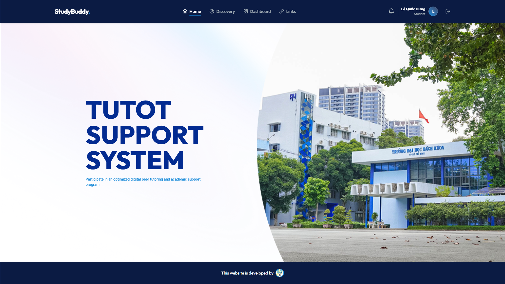
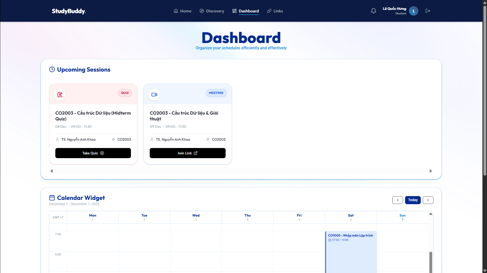
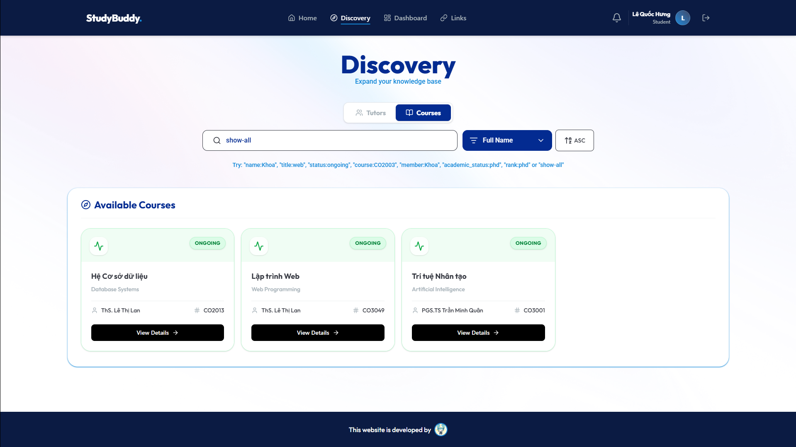
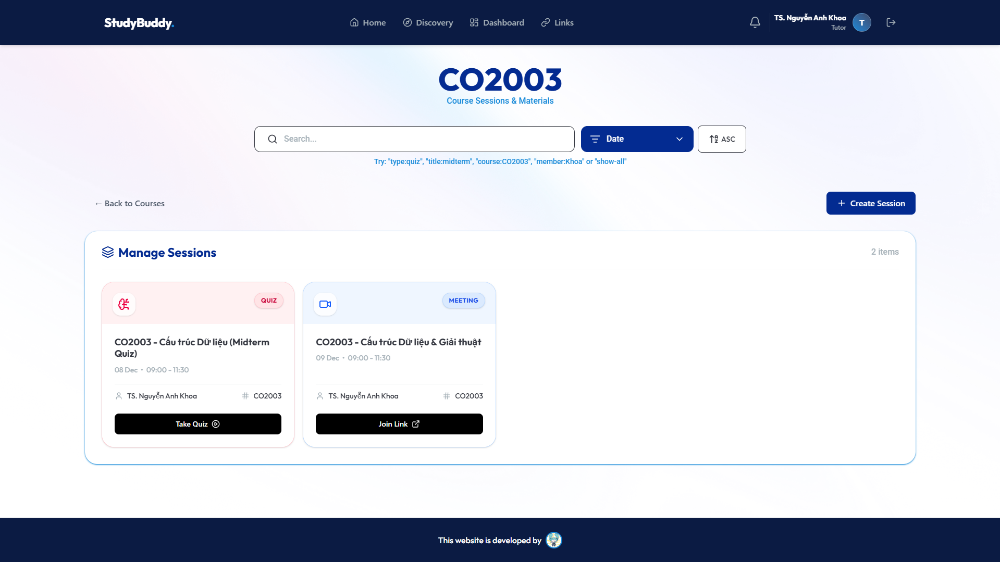
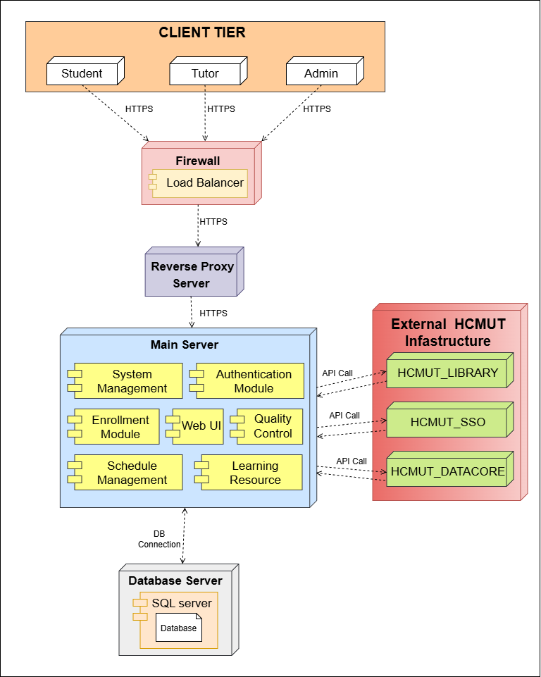

# 🏫 Study Buddy

I took the role as a fullstack developer in several key areas across the entire development cycle in this project. 

In particular, I am responsible for the website **UI/UX design** using Figma, focusing on creating an intuitive, student-friendly layout.

Said design was brought to life by implementing a fully functional, responsive frontend utilizing the ReactJS framework. 

Finally, I contributed to the architecture and development of the backend API using **ExpressJS**, ensuring seamless and efficient data flow between the client and server.

## 🪟 Project Overview

Study Buddy is developed for Ho Chi Minh City University of Technology (HCMUT) to digitalize and optimize the existing peer tutoring and academic support programs. 

The system addresses several current challenges, such as the manual coordination of tutor-student matching processes, limited visibility into tutor availability and expertise areas, inefficient scheduling and communication workflows, a lack of progress tracking and performance analytics, and fragmented feedback collection mechanisms. 

## 🎯 Project Objectives

To overcome said issues, the system aims to:

- Automate coordination of tutor-student matching processes

- Provide a centralized platform for managing students and tutors.

- Enhance academic and skill development for students through
  structured mentoring.

- Deliver an effective, scalable, and secure solution that reduces
  manual work for administrators and ensures better learning outcomes.

Ultimately, the system helps the university optimize resources, personalize support, and improve the overall student experience.

## ⚙️ Technology Stack

- **Frontend:**

  - React 19.2 with Vite build tool

  - React Router DOM for navigation

  - Tailwind CSS for responsive design

  - Lucide React icons library

  - date-fns for date manipulation

- **Backend:**

  - Node.js with Express.js framework

  - MySQL database driver

  - JWT for authentication and authorization

  - bcryptjs for password encryption

  - CORS for cross-origin requests

- **Database:**

  - MySQL with stored procedures and triggers for business logic

  - Automatic timestamp management

  - Role-based data access control

## 💻 User Interface

### Homepage

### Dashboard

### Tutors and Courses Discovery

### Session Management

## 🔩 System Architecture

